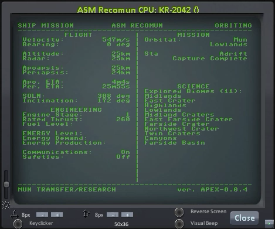

# kOS-MissionControl
This is a work in progress set of Mission Control protocols, 
libraries and utilities for Kerbal Space Program using kOS 
and RemoteTech.

These protocols will leverage content from other authors on 
Git and from the internet and they will be credited in the 
license file when possible, but for the purpose of conserving 
as much kOS disk space as possible, author comments will not 
be provided in msc refactored .ks files themselves.

Mission Control Protocol Hierarchy

1. Preflight Check
    a. Evaluate Flight Capability - command, comms
    b. Evaluate Mission Capability - science, mining, refining
    c. Evaluate Engineering - engines & fuel (by stage), electric charge 
        storage and generation
2. Mission Check
    a. ID the ship and pull any related boot and mission files.
    b. If no files are found, prompt user for mission sequence.
    c. Once the files are loaded or mission sequence established, 
      create the library file required for all mission tasks and 
      copy to the ship's primary CPU.
3. Mission Boot and/or Mission Files
    a. Replaces preflight boot and mission check files with the 
      dedicated mission boot and protocol files or uses generic 
      files based on user-input sequence. Otherwise, the bare 
      bones mission file will launch, ascend to 100km, circularize, 
      then perform an un-controlled drop of the ship back to the body 
      it just launched from attempting to keep the ship in retrograde 
      and deploying the chute(s) as necessary.
    b. Builds a single master library file from the archive libraries 
      as necessary to complete the associated mission.
    c. Includes scheduled and unscheduled intervals for mission updates
      and overrides.

The goal of this project is to fabricate the infrastructure 
for a fully functional Mission Control platform to interact 
with and overlay the kOS interface. If the project becomes 
comprehensive enough, the final stage will be to produce a 
new Mission Control UI mod that will allow users to plan, 
execute and monitor hands-free manned and unmanned 
missions with little to no actual programming in kOS.

If successful, a subset of features are also planned to add 
additional support for RemoteTech with realistic handling of 
unmanned missions as well as metered feature governance in 
Career mode.
